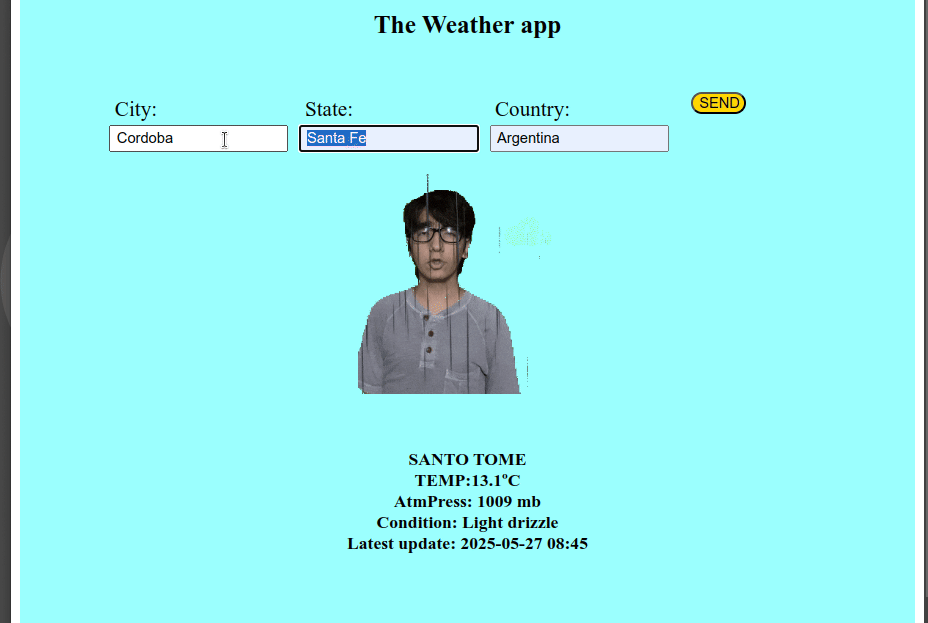

# Weather-App

Simple Weather app for the Odin Project

## Build

```bash
npm install
npm run build
```

Then launch /dist/index.html with your browser.

## Preview



## Reference

<https://www.theodinproject.com/lessons/node-path-javascript-weather-app>
